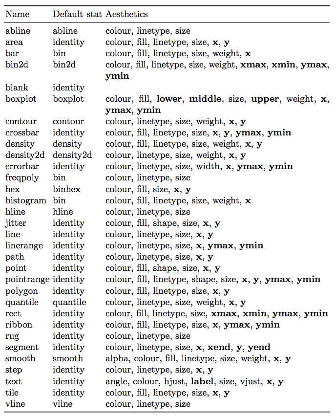

This is an incomplete lesson, and an even worse reference meant to get someone on their feet & give them a survey of the powers of ggplot2. For a more complete guide see [the book](https://github.com/hadley/ggplot2-book) and for a more complete reference see [the documentation](http://ggplot2.tidyverse.org/reference/).

To get started, the only thing your data needs to be is a) be, b) a dataframe, c) "long", and d) properly classed. By properly classed I don't mean it needs to be the diamonds dataset, I mean that each column in your dataframe should be explicitly cast as the datatype you intend it to be - as.factor() your factors and as.numeric() your numbers. 

But we are gonna use diamonds because we are properly classed.


```{r}
library(ggplot2)
head(diamonds)

# But we don't want to plot 50000 points every time so
diamond_sub <- diamonds[sample(1:nrow(diamonds), 500, replace=FALSE),]
```

# A Layer

What is a statistical graphic? The good ole boys [Wilkinson](http://www.springer.com/us/book/9780387245447) and [Wickham](http://www.tandfonline.com/doi/abs/10.1198/jcgs.2009.07098) tell us that they are

* "Mappings from data to aesthetic attributes (colour, shape, size) 
* Of geometric objects (points, lines bars)
* On a particular coordinate system
* Perhaps after a statistical transformation

We'll follow their lead. In ggplot, that combination of things forms a layer. The terminology in ggplot is

* **aes** - aesthetic mappings
* **geom** - geometric objects
* **scale** - ...scales
* **stat** - statistical transformations

## (Aes)thetic mappings

Lets get ahead of ourselves and make a plot because we haven't made one yet and our console is whining in the backseat.
```{r}
g <- ggplot(diamond_sub, aes(x=carat, y=price))+
  geom_point()
g
```

Nice. You are now better qualified to make graphics than 90% of business dudes who still plot with excel for some reason. What did we do there? 

We made a ggplot object named "g" that is attached to the dataframe "diamond_sub" `g <- ggplot(diamond_sub,` and has the aesthetic parameters "x" and "y" mapped to the columns "carat" and "price," respectively `aes(x=carat, y=price))`. Then we added `+` another element to our plot, `geom_point()` which tells us that we want our aesthetic mapping represented geometrically as points. Note that we have to add parentheses to tell R that we want that function evaluated even if we don't pass any arguments. We then rendered the plot by calling the variable name `g`.

Each geom (or more precisely, each stat, but we'll get to that in a bit) has a certain subset of aes's that apply to it (don't we all). 

You can list all aes's with 
```{r}
ggplot2:::.all_aesthetics
```

or by doing the same on the proto version of any geom, like
```{r}
ggplot2:::GeomPoint
```
Note the "required_aes" and "non_missing_aes" for required and optional aes, respectively.

In general, you'll always have color (or colour, color is just an alias), x, and y. Commonly you'll also have fill for things that take up area, 

Aesthetics, unless otherwise specified, apply to each added element. Within a given element, you can add, override, or remove aesthetics, like so:
```{r}
# Add coloring by ... color, and modify y to make some lines by depth
ggplot(diamond_sub, aes(x=carat, y=price))+
  geom_line(aes(y=price))+
  geom_point(aes(color=color))
```

```{r}
# Say we want color for a bunch of elements (not pictured) but not in our lines.
ggplot(diamond_sub, aes(x=carat, y=price, color=color))+
  geom_point()+
  geom_line(aes(color=NULL))
```

Damn those are some ugly graphs, but this guide is about "can" not "should." Notice how the order in which you add elements matters. 

You can also perform operations within the aes(), say if you want to fatten out a ribbon without it being a big goofy line
```{r}
economics_epoch <- economics
economics_epoch$epoch <- as.factor(c(rep(1,100),
                                     rep(2,100),
                                     rep(3,100),
                                     rep(4,274)))
ggplot(economics_epoch, aes(x=date,color=epoch))+
  geom_line(aes(y=unemploy), size=10)
```

So goofy.

```{r}
ggplot(economics_epoch, aes(x=date,fill=epoch))+
  geom_ribbon(aes(ymax=unemploy,ymin=unemploy-1000))
```

Also, it's common to confuse "fill" and "color." You can see the difference:
```{r}
ggplot(economics_epoch, aes(x=date,color=epoch))+
  geom_ribbon(aes(ymax=unemploy,ymin=unemploy-1000))
```

And if you wanted to use both for different reasons because you're a maniac

```{r}
ggplot(economics_epoch, aes(x=date,color=epoch, fill=rev(epoch)))+
  geom_ribbon(aes(ymax=unemploy,ymin=unemploy-1000))
```

You can also assign single values to an aes, though as we'll see, it's usually better to do that in a scale. You can give colors using [color names](http://www.stat.columbia.edu/~tzheng/files/Rcolor.pdf) or [RGB hex values](https://coolors.co) passed outside the aes argument - remember the aes is a mapping from the data to the geom! Assigning a `fill` within the aes argument assumes you mean that your hex value is a level in a factor (and who could blame it). 

```{r}
ggplot(economics_epoch, aes(x=date))+
  geom_ribbon(aes(ymax=unemploy,ymin=unemploy-1000), fill="#F0A125")
```

ggplot will do its best to figure out how to split your data when combining multiple aesthetics, but here is one extra trick:

Say you want to split your data by two factors but don't want to make a new column in your dataframe or color them. You can use the `interaction()` function like (ignore the use of theme(), we'll get to that):
```{r}
ggplot(diamond_sub, aes(x=interaction(cut,color)))+
  geom_bar()+
  theme(
    axis.text.x = element_text(angle=90)
  )
```

I'll give ya a list of all the aesthetics by shapes once we know what a stat is.

## Geoms & Stats

I've already thrown a lot of geoms your way, but there are a lot more where that came from. I'm not going to do a complete runthrough of all of them here because most of their use is relatively obvious once you know how to manipulate aesthetics, but if you're hungry for it someone put together a nice graphical summary of the available geoms:


This section is more concerned with the relationship between geoms and stats. Behind every great geom there's a great stat. Stats act as intermediary functions between the incoming data and the geom - put another way, they relate the aes to the geom. Most common geoms just use the `stat_identity` that returns the number, but many can accept a `stat="stat_as_string"` argument. Below is a table of geoms, their default stats, and their related aesthetic options (from page 57 of the ggplot book)



A few examples of how to represent frequency data by manipulating stat:

A classic histogram

```{r}
ggplot(diamond_sub, aes(x=price))+
  geom_histogram(color="white", bins = 20)
```

If instead one wants the scale as a density,

```{r}
ggplot(diamond_sub, aes(x=price))+
  geom_histogram(aes(y=..density..), color="white", bins = 20)
```

Other stats can be accessed by calling another geom that uses it as their default. We can estimate a density kernel like:

```{r}
ggplot(diamond_sub, aes(x=price))+
  geom_histogram(aes(y=..density..), color="white", bins = 20)+
  geom_density()
```

Yikes, our kernel is a little soft. We can adjust the bandwidth of the kernel (as its standard deviation)... 

```{r}
ggplot(diamond_sub, aes(x=price))+
  geom_histogram(aes(y=..density..), color="white", bins = 20)+
  geom_density(bw=300)
```

How about some two dimensional data? I need lines. thankfully we can directly perform linear models in ggplot.

```{r}
ggplot(diamond_sub, aes(x=table, y=depth))+
  geom_point(alpha=0.2)+
  geom_smooth(method="lm", color="red", se=FALSE)
```

And if you want your confidence intervals right there with ya too
```{r}
ggplot(diamond_sub, aes(x=depth, y=table))+
  geom_point(alpha=0.2)+
  geom_smooth(color="red", method="lm", level=0.99)
```

We can also perform a few other smoothing/estimation operations, for example

```{r}
ggplot(diamond_sub, aes(x=table, y=depth))+
  geom_point(alpha=0.2)+
  geom_smooth(method="loess", color="red")
```

And with a bit of convincing, ggplot will even do logistic regression for us

```{r}
ggplot(midwest, aes(x=percbelowpoverty, y=inmetro))+
  geom_point(alpha=0.1)+
  geom_smooth(method="glm", method.args=list(family="binomial"), color="red")
```

Most geoms can be controlled directly by calling their related stat. When doing so, we can select which geom we'd like to plot our error bars with.

```{r}
ggplot(economics, aes(x=date, y=unemploy))+
  geom_line(color="gray")+
  stat_smooth(geom="linerange", size = 0.5, method="loess", level=0.99)
```


How about some denser data. Remember our very first plot? There's a whole lot more data that we randomly ignored. What if we weren't some fraudulators and didn't conveniently "lose our data?"

```{r}
ggplot(diamonds, aes(x=carat, y=price))+
  geom_point(alpha=0.02)
```

Wow that's cool and smoky and all, but is it a good representation of the data?. If we summarize it with some hexagons ...

```{r}
ggplot(diamonds, aes(x=carat, y=price))+
  geom_hex(bins=50)
```

Turns out it's really easy to misrepresent your data if it's not presented in a quantitatively meaningful way. Most of the density of our plot is in the lowest left section. Let's try one more visualization method. Notice the `..density..` notation. Since density is a computed function, it is wrapped in a sorta weird half ellipse to make sure it doesn't conflict with the dataframe in case it has a variable called density. 

```{r}
ggplot(diamonds, aes(x=carat, y=price))+
  stat_density_2d(geom = "point", aes(size = ..density..), n=50, contour = F)
```

## Position

Is also important but I'm not covering it right now. ve most deel vis it.

# A Layout

We have led our little geometric lambs to water, but what good is it if we don't own the land?

## Scales

Every aesthetic component, including axes, is a scale. There are two types of scales, continuous and discrete. With scales, we control things like 

* **Color**
* **Breaks** - if it's an axis, where do we have ticks, if it's a legend, what is marked in the legend?
* **Labels** - what do we call our breaks?
* **Limits**
* **Expand** - how much extra room we leave on the edges
* **Transformations** - log scales & arbitrary transformations
* **Position** - If an axis, reposition top, bottom, left, or right depending on whether it's an x or y axis.

The general syntax to modify your scale is `scale_aesthetic_continuous` or `scale_aesthetic_discrete`, for example `scale_x_continuous` or `scale_fill_discrete`.

For now, not going to spend much time on this because they are relatively self explanatory, but a few specific useful examples

### Color Brewer

If you don't want to manually input colors and want to just follow best principles, color brewer is a godsend. Visit the [color brewer website](http://colorbrewer2.org) to see available color palettes. Or we can use a tool from RColorBrewer (to be covered in extensions):
```{r, fig.height=8}
brewplot <- RColorBrewer::display.brewer.all()
```

To simply drop it in to any plot:

```{r}
ggplot(economics_epoch, aes(x=date,fill=epoch))+
  geom_ribbon(aes(ymax=unemploy,ymin=unemploy-1000))+
  scale_fill_brewer(palette="Set1")
```

And the continuous variant is called "Distiller"

```{r}
ggplot(diamond_sub, aes(x=carat,y=price,color=price))+
  geom_point()+
  scale_color_distiller(palette="RdPu")+
  theme_dark()
```

### Manual Colors

To use your own colors, use `scale_color_manual` or `scale_fill_manual`
(todo, trying to get some actually cool stuff in here)

## Facets

(skipping for now)

## Coordinate Systems

(skipping for now)

## Themes

The `theme()` command allows you fine control over each plot element. There are a few general types of plot elements:

* line
* rect
* text

That are grouped by where they are used, for example in

* axis
* legend
* panel - individual plotting areas, for example each facet in a facet grid
* plot - the entire plotting area
* strip - titles on facets

Settings are inherited hierarchically. For example, one can set the size of all text, the size of all axis titles, or just the x axis title. Reference to each is straightforward:

`text = element_text(),`
`axis.title = element_text(),`
`axis.title.x = element_text()`

ggplot comes with a few built-in themes:

```{r}
ggplot(diamond_sub, aes(x=carat,y=price,color=price))+
  geom_point()+
  theme_minimal()
```

```{r}
ggplot(diamond_sub, aes(x=carat,y=price,color=price))+
  geom_point()+
  theme_void()
```

### Removing elements

Sometimes you want to be all draped in pearls and roses, and other times you just need your black turtleneck. To remove items, replace them with a blank element:

```{r}
ggplot(diamond_sub, aes(x=carat,y=price,color=price))+
  geom_point()+
  theme(
    panel.background= element_blank(),
    panel.grid      = element_blank(),
    axis.text       = element_blank(),
    axis.ticks      = element_blank(),
    axis.title      = element_blank(),
    axis.line       = element_line(),
    legend.position = "none"
  )
```

And sometimes you just want to make a mockery of your audience's eyes like you've got your hands in the MS paint bucket again. Notice how since we are in a "g" rammar of "g" raphics ("plot") ("2") things work as we expect them to

```{r}
ggplot(diamond_sub, aes(x=carat,y=price))+
  geom_point(color="pink")+
  theme(
    panel.background= element_rect(fill="yellow"),
    panel.grid      = element_blank(),
    axis.text       = element_blank(),
    axis.ticks      = element_blank(),
    axis.title      = element_blank(),
    axis.line       = element_line(),
    legend.position = "none"
  )
```

A useful tool here is the direct specification of sizes with units. The general syntax for units are unit(number, "unit_type"), for example if you are trying to shout about how big those numbers are and dont understand what axis ticks are for

```{r}
ggplot(diamond_sub, aes(x=carat,y=price))+
  geom_point()+
  theme(
    panel.background= element_blank(),
    panel.grid      = element_blank(),
    axis.text       = element_text(size=unit(24,"pt")),
    axis.ticks      = element_line(arrow=arrow(type="closed")),
    axis.title      = element_blank(),
    axis.line       = element_line(),
    legend.position = "none"
  )
```

Uh oh, who is screwing with our medicine? Our text is now hopelessly buried beneath our arrows. We can fix that by adjusting our margins. The margins are set in the order top, right, bottom, left. Since that doesn't really make sense, they advise you to remember the phrase "trouble" and that actually works. Notice the inheritance. Even though we make settings for the x and y axis text specifically, it still retains our 24 point mistake. Margins can also be used with the plot.background to eliminate excess space, and can be set to negative numbers.

```{r}
ggplot(diamond_sub, aes(x=carat,y=price))+
  geom_point()+
  theme(
    panel.background= element_blank(),
    panel.grid      = element_blank(),
    axis.text       = element_text(size=unit(24,"pt")),
    axis.text.x    = element_text(margin= margin(20,0,0,0, unit="pt")),
    axis.text.y     = element_text(margin= margin(0,20,0,0, unit="pt")),
    axis.ticks      = element_line(arrow=arrow(type="closed")),
    axis.title      = element_blank(),
    axis.line       = element_line(),
    legend.position = "none"
  )
```

# Rendering

## ggsave

## Grid

## LaTeX integration

# Some DoPlots To Tittilate

Here we see the plot in its native habitat, with its code fragmented from hours of drinking at your desk while trying to figure out what the hell a null unit is.

## Segments & Border Whiskers

```{r}
library(grid)
library(gtable)
library(gridExtra)

load("data/gendat_mouse_rs.R", .GlobalEnv)
load("data/gendat_mouse.R", .GlobalEnv)

# Set some colors
scat_cols <- c("GT2_LINE"="#A54601","GT3_LINE"="#196B52")

# Generalization Type Scatter/Regression plot
g.genscat_scat <- ggplot(gendat.mouse.rs,aes(x=gt1)) + 
  geom_point(aes(y=gt2),col="#FF6B02",alpha=0.8,size=2) +
  geom_smooth(aes(y=gt2,colour="GT2_LINE"),method=lm,se=TRUE,size=0.75) +
  geom_point(aes(y=gt3),col="#1b9e77",alpha=0.8,size=2) +
  geom_smooth(aes(y=gt3,colour="GT3_LINE"),method=lm,se=TRUE,size=0.75) +
  scale_x_continuous(expand = c(0, 0),
                     breaks=c(0.65,0.7,0.75,0.8,0.85),labels=c("65","70","75","80","85")) + 
  scale_y_continuous(expand = c(0, 0),
                     breaks=c(0.5,0.55,0.6,0.65,0.7,0.75),labels=c("50","55","60","65","70","75")) + 
  expand_limits(x=c(0.62,0.86),y=c(0.5,0.80))+
  ylab("Generalization Accuracy (%)") +
  xlab("Learned Token Accuracy (%)") +
  scale_colour_manual(values=scat_cols,
                      labels=c(expression(paste("Type 2 -  ",beta,": 0.52,  ", R^{2},":0.70")), 
                               expression(paste("Type 3 -  ",beta,": 0.65,  ", R^{2},":0.58"))))+
  guides(colour=guide_legend(override.aes=list(size=5)))+
  theme(panel.background  = element_rect(fill="#F5F5F5"), 
        panel.grid.major  = element_blank(),
        panel.grid.minor  = element_blank(),
        plot.background   = element_rect(fill="transparent",colour=NA),
        axis.title.y      = element_text(size=rel(1),margin=margin(2,7,2,10,unit="pt")),
        axis.text.y       = element_text(size=rel(1),margin=margin(1,3,1,1,unit="pt")),
        axis.text.x       = element_text(size=rel(1),margin=margin(7,1,1,1,unit="pt")),
        axis.title.x      = element_text(size=rel(1),margin=margin(7,2,10,2,unit="pt")),
        legend.position   = c(.7,.2),
        legend.text       = element_text(size=rel(.8)),
        legend.title      = element_blank(),
        legend.background = element_blank(),
        legend.key        = element_blank(),
        plot.margin       = unit(c(0,0,0,0),"lines"))

g.genscat_boxhorz <- ggplot(gendat.mouse.rs,aes(x=factor(1),y=gt1))+
  geom_boxplot()+
  geom_point(size=1) + 
  scale_y_continuous(expand = c(0, 0)) + 
  #expand_limits(y=c(0.62,0.86))+
  coord_flip()+
  theme(panel.background = element_blank(), 
        panel.grid.major = element_blank(),
        panel.grid.minor = element_blank(),
        plot.background  = element_rect(fill="transparent",colour=NA),
        axis.title.y     = element_blank(),
        axis.text.y      = element_blank(),
        axis.title.x     = element_blank(),
        axis.text.x      = element_blank(),
        axis.ticks.x     = element_blank(),
        axis.ticks.y     = element_blank(),
        legend.position  = "none",
        plot.margin      = unit(c(1,0,0,0),"lines"))

g.genscat_boxvert <- ggplot(gendat.mouse.rs,aes(x=factor(1))) +
  geom_boxplot(aes(y=gt2),col="#A54601") +
  geom_point(aes(y=gt2),col="#FF6B02",size=1) +
  geom_boxplot(aes(x=factor(2),y=gt3),col="#196B52") +
  geom_point(aes(x=factor(2),y=gt3),col="#1b9e77",size=1) +
  scale_y_continuous(expand = c(0, 0)) + 
  expand_limits(y=c(0.45,0.80))+
  theme(panel.background = element_blank(), 
        panel.grid.major = element_blank(),
        panel.grid.minor = element_blank(),
        plot.background  = element_rect(fill="transparent",colour=NA),
        axis.title.y     = element_blank(),
        axis.text.y      = element_blank(),
        axis.title.x     = element_blank(),
        axis.text.x      = element_blank(),
        axis.ticks.x     = element_blank(),
        axis.ticks.y     = element_blank(),
        legend.position  = "none",
        plot.margin = unit(c(0,0,0,0),"lines"))

# Combine plots, see https://www.r-bloggers.com/scatterplot-with-marginal-boxplots/
g.genscat_gtabscat <- ggplotGrob(g.genscat_scat)
g.genscat_gtabhorz <- ggplotGrob(g.genscat_boxhorz)
g.genscat_gtabvert <- ggplotGrob(g.genscat_boxvert)

maxW <- unit.pmax(g.genscat_gtabscat$widths[2:3],g.genscat_gtabhorz$widths[2:3])
maxH <- unit.pmax(g.genscat_gtabscat$heights[4:5],g.genscat_gtabvert$heights[4:5])
g.genscat_gtabscat$widths[2:3] <- as.list(maxW)
g.genscat_gtabhorz$widths[2:3] <- as.list(maxW)
g.genscat_gtabscat$heights[4:5] <- as.list(maxH)
g.genscat_gtabvert$heights[4:5] <- as.list(maxH)

g.genscat_gtab <- gtable(widths=unit(c(7,1),"null"),height=unit(c(1,7),"null"))
g.genscat_gtab <- gtable_add_grob(g.genscat_gtab,g.genscat_gtabscat,2,1)
g.genscat_gtab <- gtable_add_grob(g.genscat_gtab,g.genscat_gtabhorz,1,1)
g.genscat_gtab <- gtable_add_grob(g.genscat_gtab,g.genscat_gtabvert,2,2)

# Generalization type scatter/line combined plot
g.gensl <- ggplot(gendat.mouse,aes(x=as.factor(gentype),y=meancx,group=as.factor(mouse)))+
  geom_point(size=1)+
  geom_line(size=0.3)+
  xlab("Generalization Type")+
  ylab("Mean Accuracy (%)")+
  scale_x_discrete(expand=c(0.1,0.1))+
  scale_y_continuous(expand=c(0,0),
                     limits=c(0.5,0.86),
                     breaks=c(0.5,0.55,0.6,0.65,0.7,0.75,0.8,0.85),
                     labels=c("50","55","60","65","70","75","80","85"))+
  theme(panel.background = element_blank(), 
        panel.grid.major = element_blank(),
        panel.grid.minor = element_blank(),
        axis.text.x      = element_text(size=rel(1),margin=margin(7,1,1,1,unit="pt")),
        axis.title.x     = element_text(size=rel(1),margin=margin(7,2,10,2,unit="pt")),
        plot.background  = element_rect(fill="transparent",colour=NA),
        legend.position  = "none",
        plot.margin      = unit(c(1,0,0,0),"lines"))

#Combination plot of above two
g.gensl.gt <- ggplotGrob(g.gensl)

g.combo <- grid.arrange(g.gensl.gt,g.genscat_gtab,widths=c(2,5))

grid.newpage()
grid.draw(g.combo)

```


## Heatmap & PCs

```{r, fig.width=3.6,fig.height=7.5}
load("data/gendat_vowmus.R", .GlobalEnv)
load("data/klust_wseg.R", .GlobalEnv)
load("data/pmc_melt.R", .GlobalEnv)
load("data/pmc_x.R", .GlobalEnv)

  # Make dendrogram
  g.dendro <- ggplot(klust.w_seg)+
    geom_segment(aes(x=x,y=y,xend=xend,yend=yend,color=cols))+
    scale_color_manual(values=c("#000000","#E21D1D","#3B4aEF","#FC7A00"))+
    scale_y_reverse(expand=c(0,0))+
    scale_x_discrete(expand=c(0.04,0))+
    theme_void()+
    theme(legend.position = "none",
          panel.background  = element_blank(), 
          panel.grid.major  = element_blank(),
          panel.grid.minor  = element_blank(),
          plot.background   = element_blank(),
          plot.margin       = margin(0,0,0,0,unit="npc"),
          axis.text         = element_blank(),
          axis.title.x      = element_blank(),
          axis.title.y      = element_blank())
    
  
  # Split into /g/ and /b/
  gendat.vowmus_g <- gendat.vowmus[gendat.vowmus$consonant==1,] 
  gendat.vowmus_b <- gendat.vowmus[gendat.vowmus$consonant==2,]
  
  # Factor & reorder so the vowels are in the right order...
  gendat.vowmus_g$vowel <- factor(gendat.vowmus_g$vowel,ordered=TRUE)
  gendat.vowmus_g$vowel <- factor(gendat.vowmus_g$vowel,levels(gendat.vowmus_g$vowel)[c(6,5,4,3,2,1)])
  gendat.vowmus_b$vowel <- factor(gendat.vowmus_b$vowel,ordered=TRUE)
  gendat.vowmus_b$vowel <- factor(gendat.vowmus_b$vowel,levels(gendat.vowmus_b$vowel)[c(6,5,4,3,2,1)])
  
  # Split (& set ID's separately so the x-axis is right)
  pmc.melt_g <- pmc.melt[pmc.melt$consonant==1,]
  pmc.melt_g$ID <- factor(paste(pmc.melt_g$consonant,pmc.melt_g$speaker,pmc.melt_g$vowel),ordered=TRUE)
  pmc.melt_b <- pmc.melt[pmc.melt$consonant==2,]
  pmc.melt_b$ID <- factor(paste(pmc.melt_b$consonant,pmc.melt_b$speaker,pmc.melt_b$vowel),ordered=TRUE)
  
  
  g.tok_g <- ggplot(gendat.vowmus_g,aes(x=mouse,y=vowel,fill=meancx)) + 
    geom_tile() + 
    ylab("Vowel") + 
    scale_y_discrete(labels=c("/u/","/e/","/ae/","/a/","/o/","/I/"),
                     position="right") + # reverse order to make the plot work
    scale_fill_distiller(type   = "div", palette="RdGy", limits=c(0,1),
                         breaks = c(0,0.5,1), labels=c("0%","50%","100%"),
                         name   = "Accuracy")+
    facet_grid(speaker ~ .,scales="free_y",space="free_y") +
    theme(panel.spacing     = unit(0,"npc"),
          panel.background  = element_blank(), 
          panel.grid.major  = element_blank(),
          panel.grid.minor  = element_blank(),
          plot.background   = element_blank(),
          axis.line         = element_blank(),
          axis.title.x      = element_blank(),
          axis.text.x       = element_blank(),
          axis.ticks.x      = element_blank(),
          axis.title.y      = element_blank(),
          axis.text.y       = element_text(size=rel(0.5)),
          legend.position   = "none",
          legend.text       = element_text(size=rel(0.5)),
          legend.title      = element_blank(),
          legend.key.height = unit(0.01,"npc"),
          legend.background = element_blank(),
          strip.text        = element_text(size=rel(0.6)),
          plot.margin       = margin(0.04,0,0,0,unit="npc"))
  
  g.tok_b <- ggplot(gendat.vowmus_b,aes(x=mouse,y=vowel,fill=meancx)) + 
    geom_tile() + 
    ylab("Vowel") + 
    scale_y_discrete(labels=c("/u/","/e/","/ae/","/a/","/o/","/I/"),
                     position="right") +
    scale_fill_distiller(type="div", palette="RdGy", limits=c(0,1))+
    xlab("Mouse") +
    facet_grid(speaker ~ .,scales="free_y",space="free_y") +
    theme(panel.spacing.y  = unit(0,"npc"),
          panel.spacing.x  = unit(0,"npc"),
          panel.background = element_blank(), 
          panel.grid.major = element_blank(),
          panel.grid.minor = element_blank(),
          plot.background  = element_blank(),
          axis.line        = element_blank(),
          axis.ticks.x     = element_blank(),
          axis.text.x      = element_blank(),
          axis.title.y     = element_blank(),
          axis.text.y      = element_text(size=rel(0.5)),
          axis.title.x     = element_blank(),
          legend.position  = "none",
          strip.text       = element_text(size=rel(0.6)),
          plot.margin      = margin(0,0,0.04,0,unit="npc"))
  
  
  # Add panels on right for consonants
  g.tok_gtab <- ggplotGrob(g.tok_g)
  g.tok_gtab <- gtable_add_cols(g.tok_gtab, unit(g.tok_gtab$widths[[5]],'cm'), 7)
  g.tok_gtab <- gtable_add_grob(g.tok_gtab,
                                rectGrob(gp=gpar(col=NA, fill=gray(0.5))),
                                6,8,14, name="glab")
  g.tok_gtab <- gtable_add_grob(g.tok_gtab,
                                textGrob("/g/", rot=-90, gp=gpar(col=gray(1))),
                                6,8,14, name="gtext")
  
  g.tok_btab <- ggplotGrob(g.tok_b) 
  
  # Add dendrogram first
  g.dend_tab <- ggplotGrob(g.dendro)
  g.dend_tab$heights[8] <- unit(0,"cm")
  g.dend_tab$widths[3] <- unit(0,"cm")
  
  g.tok_btab <- gtable_add_rows(g.tok_btab, unit(0.3, "inches"), 17)
  g.tok_btab <- gtable_add_grob(g.tok_btab, g.dend_tab,
                                17,4,19,4,name="dendro")
  
  g.tok_btab <- gtable_add_cols(g.tok_btab, unit(g.tok_btab$widths[[5]], 'cm'),7)
  g.tok_btab <- gtable_add_grob(g.tok_btab,
                                rectGrob(gp=gpar(col=NA, fill=gray(0.5))),
                                4,8,14, name="blab")
  g.tok_btab <- gtable_add_grob(g.tok_btab,
                                textGrob("/b/",rot=-90,gp=gpar(col=gray(1))),
                                4,8,14,name="btext")
  
  ###### PC plots
  # Calculate limits for bar
  pc_lim <- max(abs(pmc.melt$mean.val))
  pc_lim <- c(-pc_lim,pc_lim)
  
  g.pcw_g <- ggplot(data=pmc.melt_g,aes(x=ID,y=mean.val,fill=as.factor(speaker)))+
    scale_fill_manual(values=c("#000000","#757575","#000000","#757575","#000000"))+
    geom_bar(stat='identity')+
    coord_flip()+
    scale_x_discrete(limits=rev(levels(pmc.melt_g$ID)))+
    scale_y_continuous(limits=pc_lim)+
    facet_wrap(~X2)+
    theme(
      panel.background = element_blank(), 
      panel.grid.major = element_blank(),
      panel.grid.minor = element_blank(),
      plot.background  = element_blank(),
      axis.text        = element_blank(),
      axis.title       = element_blank(),
      axis.line        = element_blank(),
      axis.ticks       = element_blank(),
      strip.text       = element_blank(),
      strip.background = element_blank(),
      plot.margin      = margin(0,0,0,0,unit="npc"),
      panel.spacing.y  = unit(0,"npc"),
      legend.position  = "none"
    )
  
  g.pcw_b <- ggplot(data=pmc.melt_b,aes(x=ID,y=mean.val,fill=as.factor(speaker)))+
    scale_fill_manual(values=c("#000000","#757575","#000000","#757575","#000000"))+
    geom_bar(stat='identity')+
    coord_flip()+
    scale_x_discrete(limits=rev(levels(pmc.melt_b$ID)))+
    scale_y_continuous(limits=pc_lim)+
    facet_wrap(~X2)+
    theme(
      panel.background = element_blank(), 
      panel.grid.major = element_blank(),
      panel.grid.minor = element_blank(),
      plot.background  = element_blank(),
      axis.text        = element_blank(),
      legend.position  = "none",
      axis.title       = element_blank(),
      axis.line        = element_blank(),
      axis.ticks       = element_blank(),
      strip.text       = element_blank(),
      strip.background = element_blank(),
      plot.margin      = margin(0,0,0,0,unit="npc"),
      panel.spacing.y  = unit(0,"npc")
    )
  
  # Flip values so they align w/ heatmap orientation
  pmc.x$genbias <- pmc.x$genbias * -1
  
  ###### Now the scatter/line plots of PC loadings vs. bias/accuracy.
  g.pc1 <- ggplot(data=pmc.x,aes(x=PC1,y=genbias))+
    geom_point(aes(shape=cohort))+
    scale_shape_manual(values=c(16,1))+
    geom_smooth(method=lm,se=FALSE,size=0.75,color="black")+
    labs(x="PC1 Loading",y="Bias")+
    scale_y_continuous(breaks=c(-0.2,-0.1,0,0.1),labels=c("+20% /g/","+10% /g/","0%","+10% /b/"))+
    theme(
      panel.background = element_blank(), 
      panel.grid.major = element_blank(),
      panel.grid.minor = element_blank(),
      plot.background  = element_blank(),
      legend.position  = "none",
      axis.line        = element_blank(),
      plot.margin      = margin(0,0,1,3,unit="pt"),
      panel.spacing.y  = unit(0,"npc")
    )
  
  g.pc2 <- ggplot(data=pmc.x,aes(x=PC2,y=meancx))+
    geom_point(aes(shape=cohort))+
    scale_shape_manual(values=c(16,1))+
    geom_smooth(method=lm,se=FALSE,size=0.75,color="black")+
    labs(x="PC2 Loading",y="% Correct")+
    scale_y_continuous(limits=c(0.60,0.85),breaks=c(0.65,0.75,0.85),labels=c("65%","75%","85%"))+
    theme(
      panel.background = element_blank(), 
      panel.grid.major = element_blank(),
      panel.grid.minor = element_blank(),
      plot.background  = element_blank(),
      legend.position  = "none",
      axis.line        = element_blank(),
      plot.margin      = margin(1,0,0,3,unit="pt"),
      panel.spacing.y  = unit(0,"npc")
    )
  
  ## Combine heatmap and PCplots
  # Get pc grobs
  g.pcw_gtab <- ggplotGrob(g.pcw_g)
  g.pcw_btab <- ggplotGrob(g.pcw_b)
  g.pc1_tab  <- ggplotGrob(g.pc1)
  g.pc2_tab  <- ggplotGrob(g.pc2)
  
  # Add columns to heatmap grids
  g.tok_gtab <- gtable_add_cols(g.tok_gtab,rep(unit(0.2,"npc"),2),0)
  g.tok_btab <- gtable_add_cols(g.tok_btab,rep(unit(0.2,"npc"),2),0)
  
  # Add PC plots to heatmaps
  g.tok_gtab <- gtable_add_grob(g.tok_gtab,
                                g.pcw_gtab,
                                6,1,17,2,name="gtok")
  g.tok_btab <- gtable_add_grob(g.tok_btab,
                                g.pcw_btab,
                                4,1,15,2,name="gtok")
  
  # Add labels above PC plots
  g.tok_gtab <- gtable_add_rows(g.tok_gtab, unit(0.2,"inches"), 4)
  g.tok_gtab <- gtable_add_grob(g.tok_gtab,
                                rectGrob(gp=gpar(col=NA,fill=gray(0.5))),
                                5,1,5,name="pc1box")
  g.tok_gtab <- gtable_add_grob(g.tok_gtab,
                                rectGrob(gp=gpar(col=NA,fill=gray(0.5))),
                                5,2,5,name="pc2box")
  g.tok_gtab <- gtable_add_grob(g.tok_gtab,
                                textGrob("PC1",gp=gpar(col=gray(1))),
                                5,1,5,name="pc1")
  g.tok_gtab <- gtable_add_grob(g.tok_gtab,
                                textGrob("PC2",gp=gpar(col=gray(1))),
                                5,2,5,name="pc2")
  
  # Add scale bar
  colvals <- data.frame(xvals=seq(0,1,0.01),yvals=as.factor(rep(0,101)))
  g.scale <- ggplot(data=colvals,aes(x=xvals,y=yvals,fill=xvals))+
    scale_fill_distiller(type="div", palette="RdGy", limits=c(0,1))+
    geom_raster(interpolate=TRUE)+
    scale_x_continuous(expand=c(0,0))+
    annotate("text", x=0.1, y=1, label = "0%",colour = "white", size=3.5)+
    annotate("text", x=0.85, y=1, label = "100%", colour= "white", size = 3.5)+
    theme_void()+
    theme(legend.position="none",
          plot.margin = margin(0,0,0,0,unit="npc"))
  g.scalegrob <- ggplotGrob(g.scale)
  g.scalegrob$widths[3] <- unit(0,"npc")
  g.scalegrob$heights[7] <- unit(0,"npc")
  
  g.tok_gtab <- gtable_add_grob(g.tok_gtab,
                                g.scalegrob,
                                5,6,5,6,name="scale")
  
  # Combine/Align scatterplots
  g.pc2_tab$widths <- g.pc1_tab$widths
  g.pcs <- gtable(widths=unit(c(2),"null"),height=unit(c(1,1),"null"))
  g.pcs <- gtable_add_grob(g.pcs,g.pc1_tab,1,1)
  g.pcs <- gtable_add_grob(g.pcs,g.pc2_tab,2,1)
  
  g.tokpc <- arrangeGrob(g.tok_gtab,g.tok_btab,g.pcs,ncol=1,widths=unit(3.6,"inches"),heights=unit(c(2.45,2.55,2.5),"inches"))
  
  grid.newpage()
  grid.draw(g.tokpc)
  

```